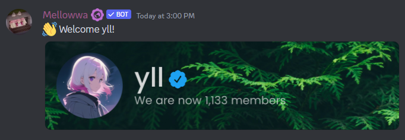

# Audit Logging

### 👑 MEE6

MEE6 Audit Logging is just as any other audit logger bot, it logs events that happen inside the server. The difference between other bots and MEE6, is MEE6 has some logging locked up behind premium.

<figure><figcaption></figcaption></figure>

It Starts off Normally by letting you choose the channel where all the events will be logged.&#x20;

<figure><figcaption></figcaption></figure>

Except for a fact that, the most important, Message events is locked up behind premium. Honestly, Message event logging is very important, even more if invite posted is behind premium, you will never figure out what the person deleted, or edited without MEE6 Premium!

### 🔍 Alternative 1 - [Logger](https://logger.bot/)

Some events? What are some? Don’t worry, the logger won’t skimp out on logs! With a single command, you can let the logger log everything the API lets it log about your server! It can log when a channel is created/edited/deleted, a user is banned/unbanned, Emojis are created/edited/deleted, a user joins/leaves/is kicked, a bot is added to the server, a user is given/revoked a role, a role is created/edited/deleted, show role and channel permissions that are changed, server properties are updated (name, region, moderation, etc), a message is updated/deleted/bulk deleted, a user is given a nickname, a user joins/leaves a voice channel, a user is muted/deafened in a voice channel.


Price: 0$


<figure><figcaption></figcaption></figure>
