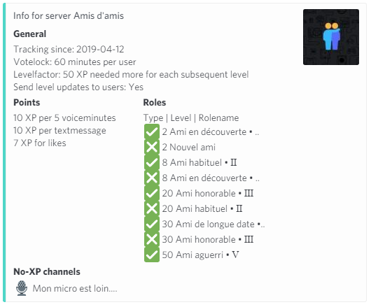

# 👑 Welcome & Goodbye

### 👑 MEE6

We're not entirely sure what you can do with the MEE6 Welcome & Goodbye feature since it's a Premium feature and the latest relevant Support Base article is from August 2022 and doesn't show us what you can configure if you had Premium. They describe it as: "Automatically give new members a warm welcome on your server with a style message, image, and role." and it costs **€12 per Month.**

### 🔍 Alternative 1: ProBot

ProBot provides comprehensive customization options for welcome images, allowing you to personalize the experience for new members. You can determine where the image is sent, whether to include any text, and even customize the background, text style, and message content.

It's honestly pretty much a full-blown image editor if you're the kind of person who can really get down and dirty with that sort of thing.

💵 All of the features for ProBot listed above are completely free.



### 🔍 Alternative 2: Welcomer

As it is in the name of the bot we expect this bot to be really good, and it is. It has fantastic customization, and has a completely custom embed builder for your welcome and goodbye messages, as well as an image editor, though not as in-depth as the ProBot one.

For that small oversight, it does make up for with sheer number of customization options. Honestly speaking, both of these bots will do the job 99% of people want from a Welcome & Goodbye function.

💵 Adding a Custom Background to your Welcome Image is a premium feature for a one-time payment of $6



### 🔍 Alternative 3: Wamellow

Give a warm welcome to new members, introducing them to rules, topics, and ongoing events. Ensure a positive, inclusive experience from the start, fostering community and engagement. Add custom content, embed, images, card background and more for free. You can also choose to give members roles, ghost ping them in channels, restore their nickname and roles if they re-joined, delete the welcome message after a certain time, delete the welcome message if the member leaves, add reactions to the welcome message or reactions to the member's first message. You can also choose to send the member a DM. [Start the setup of Wamellow here.\
](https://wamellow.com/dashboard?to=greeting/welcome)\
&#x20;💵 All of the features for Wamellow listed above are completely free.\

<figure><figcaption>
Wamellow example welcome
</figcaption></figure>


